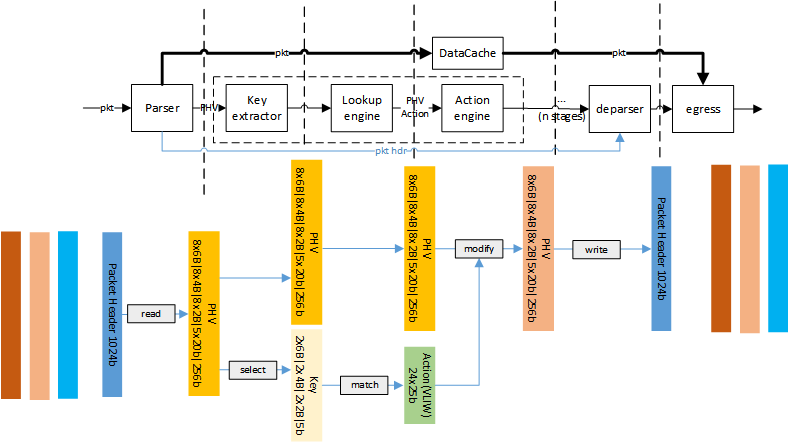
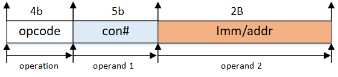
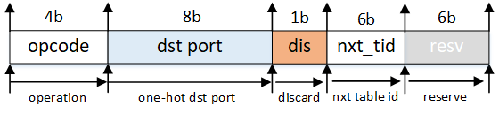
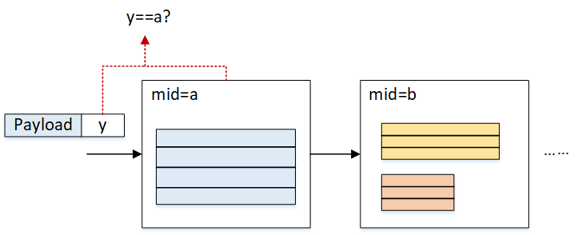
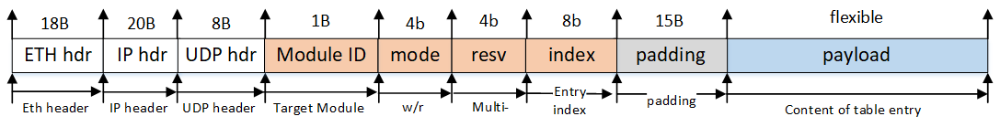

* ## Design Note

  

  ---
  
  ### **Data Plane Design**

  #### Parse Action
  
  one parse action is a 16-bit configuration, 
  
  * `[15:13]` reserved
  * `[12:6]`  byte number from 0
  * `[5:4]` container type number, `01` for 2B, `10` for 4B, `11` for 6B
  * `[3:1]` container index
  * `[0]` validity bit
  
  ---

  #### Packet Header Vector

  basically, the packet header vector needs to contain **packet header**, **metadata** (ingress port, length, etc.) and also the **instruction**. The instruction defines **how to select the fields we extracted from the header and how to do with them** (put them into a MAT key? feed them into the comparator?)

  According to RMT paper, the packet header vector contains multiple values extracted from the packet header (src ip addr, etc.) and also the metadata (ingress port, length, etc.).


  The PHV is defined as below and is 1124b wide. (5-stage pipeline)

  


  ```|8x6B|8x4B|8x2B|nx20b|256b|``` (n is num of stage of pipeline)

  * `768b`:  the packet header value container. It contains 8x 6B, 4B and 2B to store values that will be used in the match-action stage.

  * `nx20b`: comparator sub-instruction in each stage (suppose ther are 5 stages at this point).

    > * highest `2b` is the opcode: `00` for `>`, `01` for `>=` and `10` for `==`
    > * the next `1b` is the immediate flag: `1` for immediate, `0` means the value needs to be retrieved from PHV.
    > * the next `8b` represents immediate or the way to retrieve the value from PHV (lowest 5b).
    > * the lowest 9b represents the 2nd operand (same format as the 1st op).


  * `256b`:  the metadata attached to the packet. The lower 128b, namely `[127:0]`, is copied from NetFPGA's `tuser` so that it follows the specification of NetFPGA. The 128th bit is termed as drop mark, where 1 means dropping.

    > * `[127:0]` is copied from NetFPGA's `tuser` data.
    > * `[128]` is the discard flag where 1 means drop packet.
    > * `[255:250]` represents the next match table the PHV is going to be matched with.
    > * `[140:129]` is the `vlan id`.
    > * `[249:141]` is reserved for other usage.

---

  #### Key Extractor

  Key Extractor is used to generate the key according to PHV. At first, the user should config the RAM in Key Extractor to extract the values that will be used in the following Lookup module. During the runtime, Key Extractor will extract the key out of PHV according to the instructions in the RAM. **Each key include 2x6B containers, 2x4B containers and 2x2B containers as well as 5b more which indicates the result of the conditions.**

  In multi-tenant scenarios, there is the possibility that the same fields (e.g., vlan_id) are located in different containers. In order to keep the key formats consistent to each other, a small lookup table is provided to allow extracting keys from different containers for different packets. In this process, `vlan_id` (from `metadata[140:129]`) is used as the `addr` for the lookup. an **18b wide entry** will be read out from the table. The format is as follows:

  

  meanwhile, in order to support `if-else` statement, Key Extractor module also set the value of the `conditional flag` according to the `nx20b` fields to determine if the match-action should be executed in the current stage.

  * Comparation:
  
    In stage `M`, the 2 operands and the operator in `M`-th will be extracted and fed in to the comparator. If the result is `1`, the flag to the lookup table would be set, meaning the key will be matched in the lookup engine. Otherwise, the lookup engine would be bypassed and the action field will be set to `0` (meaning do nothing in the stage).

---

  #### Lookup engine

  Lookup Engine takes the key generated from Key Extractor, conducts a matching operation and outputs an VLIW-style `action` which determines the actions that need to execute in the Action Engine.


  * Format of the lookup table entry
  
    each entry is one 197b match entry to support ternary match. (192b for the key and 5b for conditional flags)
  
  * VLIW-style action table entry
  
    each entry contains 25x25b (625b in total) sub-actions, indicating how the PHV is going to be modified in the Action Engine.
  
  * Lookup elements
  
    Lookup Engine consists of 1 TCAM engine which is 197b wide.
  
  * Control plane
  
    both lookup table entry and action table wil be configured using our proposed control path. 

---

  #### Action Engine

  Action Engine takes the `action` output from Lookup Engine, and modifies PHV according to it. The actions that will be supported in the demo include `add`, `addi`, `sub`, `subi`, `load`, `loadd`, `store`, `redirect port`, `discard`, `redirect table`. (still thinking about adding VxLAN and MPLS in the pipeline). Besides all these actions mentioned above, in each stage the action engine also needs to update the `next table id` in the metadata to support TTP in the RMT architecture.

  

  1. `add`: takes two operands from the PHV based on the indexes in the action field, add them, and write the result back to the location of 1st operand.
  2. `addi` takes one operand from PHV based on the index in the action field and one operand from the action field directly, add them, and write the result back to the location of operand. 
  3. `sub`: takes two operands from the PHV based on the indexes in the action field, substract the 2nd operand from the 1st, and write the result back to the location of 1st operand.
  4. `subi`: takes one operand from the PHV based on the index in the action field and one from the action field directly, substract the 2nd operand from the 1st, and write the result back to the location of 1st operand.
  5. `load`: read the value from PHV based on the index in the action field. Then use the value as address from the stateful memory, write it into PHV according to the index of the 1st operand.
  6. `loadd`: read the value from PHV based on the index in the action field. Then use the value as address from the stateful memory. increment by 1. And write it into PHV according to the action index. Finally write it back to the RAM.
  7. `store`: read the value from PHV according to the index in the action field, write it into the address stored in the action field.
  8. `port`: send the current packet from ports listed in the action field (including multicast).
  9. `discard`: drop the current packet.
  10. `set`: set the value of PHV container to a immediate value.

  There are three types of actions: 2-operand action, 1-operand action and metadata action as is shown below.

  * Action format:
  
    For `add` (`4b'0001`), `load`(`4b'1011`), `loadd`(`4b0111'`) and `store`(`4b'1000`) and `sub` (`4b'0010`) operations, the action format is:
  
    
  
    For `addi`(`4b'1001`), `subi`(`4b'1010`), `set`(`4b'1110`), the action format is:
  
    
  
    For `port`(`4b'1100`) and `discard`(`4b'1101`), the action format is:
  
    

    The default action field is `0x3f`, which can be seen if no action is matched.


In order to support VLIW (very long instruction word) in the action engine, there are 24 standard ALUs hard-wired with 24 containers in the PHV, and also 1 extra ALU to modify the metadata field in the PHV. A workflow of the action engine can be shown in the figure below:


  

  * Support for Memory-related operations in multi-tenancy

    In the multitenancy scenario, the action engine needs to isolate the memory resources among each tenant for security reasons. In this regard, each tenant should be given a specific range of memory slot and must not access other slots. Moreover, elastic memory allocation is supported for efficient usage of such resources when both state-intensive tenants and other tenants' program running on the same device (Switch/NIC).

    In order to support elastic memory isolation between tenants, a `mapping table` should be matched before read/write any data using `load/store`. The table size is 16x16. The format:

    | vlan_id | base_addr | length |
    | ------- | --------- | ------ |
    | 0       | 0x12      | 16     |
    | 1       | 0x00      | 12     |
    | ...     | ...       | ...    |

    where `vlan_id` is the key, `base_addr` (8b) and `length` (8b) is the entry content. During a `laod/loadd/store` operation, only operations whose `addr` is less than `length` can be executed. Otherwise, the request will be dropped.

    ***Action Details:***
    
    1. To simplify the design, `store`/`load`/`loadd` supports only 4B (32b) operations, while all other actions support all 2B, 4B and 6B operands.

---

  #### Deparser

Deparser is used to recombine the packet header using info from the original packet header and PHV. Generally, it reverses the process executed in Parser.

---


  ### **Control Plane Design**

  In order to write/read table entries in the pipeline, a control plane is added and described in this section.

  #### The Method

  

  We designed a stateless method to modify the table enties in the pipeline. Specifically, we use a specialized group of packets (i.e. control packets) to modify the table entries. The packet can be generated from the SW side and contains the info about which table is going to be changed and how the table will be changed.

  In the packet header field, there are fields indicating which module (using module ID) the packets is targetting. the content of the table entry is contained in the payload field. when the packet is received by the RMT pipeline, it will recgnized by the RMT modules and will travel all the way through the pipeline.

  Each module will check whether it is the target of the packet: if so, the module will read out the payload and modify the table entry accordingly. Otherwise, it will pass the packet to the next module. If no former module matches the packet's target, before the packet comes out of the pipeline, the deparser module will drop it no matter it matches or not.

  #### Table Types

  There are 6 types of tables that need to be maintained using control plane.

  1. **Parsing Table**: This is a ***260x16 RAM*** that stores the info about how to extract containers out of the 1st 1024b of the packet. This table is duplicated in both **Parser** and **Deparser**.
  2. **Extracting Table**: This is a ***18x16 RAM*** that indicates how the KEYs are generated from PHV. This table is in **Key Extractor**. Be noted that each entry of the table should be used concurrently with a mask entry, indicating which bit should be masked (ignored).
  3. **Mask Table**: This is a ***197x16 RAM*** that masks certain bits in the key field. It is also in **Key Extractor**. 
  4. **Lookup Table** (TCAM): This is a ***197x16 TCAM*** that serves as the lookup engine in the RMT pipeline. It is in **Lookup Engine**.
  5. **Action Table**: This is a ***625x16 RAM*** that stores VLIW instruction sets. It is also in **Lookup Engine**.
  6. **Key-Value Table**: This is a ***32x32 RAM*** that supports the key-value store in RMT pipeline. It is in **Action Engine**.

  #### Data Structures

  1. Module ID
     
      We use a two-layer indexing for the modules in RMT pipeline: Except the parser and deparser, who occur only once in the pipeline, all other modules (Key Extractors, Lookup Engines, Action Engines) indicate themselves with a **8b Module ID** -> |--5b--|--3b--|. The higher 5b tells which stage it belongs to, the lower 3b tells if it is a Key Extractor, Lookup Engine or Action Engine.

      With this module ID, we will be able to index the modules precisely.

  2. Control Packet Header

      The Control Packet Header takes the advantage of Module ID to addressing the specific module, and modify the table accordingly. the format is shown below:

      

      a. `Module ID`: see the explanation above.
      
      b. `mode`: control packet type (write/read, etc.).

      c. `resv`: reserve field, can be used when there are multiple tables in a module.

      d. `index`: the index of the table entry.

      e. `padding`: used to make sure the payload starts in **the 2nd 512b** of the packet (for better engineering).

      f. `payload`: the content of the table entry, its flexible in length.

      **We use `0xf1f2` (Big Endian) as the destination port in the UDP header for RMT control packets.**


  3. Control Packet Payload
  
      To make things easier, we want each packet to be able to modify a whole table entry at a time. In order to achieve the goal. the packet length is flexible according to which table it is targeting. For example, if we are going to modify the entry of lookup table, we will only use the highest 197 bits of the payload field.
      Another design choice we made was: the control packet supports write multiple table entries with a single packet. This is enabled by adding more payload after the 1st entry.

  #### Implementation Details

  1. We made each table dual-port RAM or CAM, thus making sure that the control packet will have no influence on the data path in all the modules. The entries will be modified using the write port.

  2. The 2nd layer index (lowest 3b) of the Module ID is: **0x0** for Parser, **0x1** for Key Extractor, **0x2** for Lookup Engine, **0x3** for Action Engine, **0x5** for Deparser.

  3. In order to have better isolation between control and data path, we **added a module (pkt_filter) in front of the RMT pipeline to filter out control packets**, and feed the control packets to the pipeline using a different AXIS channel.

  #### Security Patch

  One of the security threat that must take into consideration is "attackers may send molicious control packets to bring down the switch/NIC". To mitigate this, the control path leverages a cookie mechanism to ensure only users who know the cookie value are able to configure the hardware.

  Specifically, the cookie is put in the 15B padding field in control packets, and is verified in `pkt_filter`. The cookie is updated every 400 seconds (8min). In order to issue a table update, the CPU needs to firstly read out the cookie via PCIe (using AXIL) and patch the cookie in the padding field. Once the control paackets reach the pipeline, `pkt_filter` checks whether the cookie value matches: if so, the table reconfiguration will be issued successfully; otherwise, the control packet will be treated as iligal and will be dropped.

  Two key points regarding cookie implementation:

  1. **Cookie register:** Cookie register is 32b-wide and is put in the `rmt_pipeline` top module. The cookie value is updated using a hash method in every 480s (8min, using a self-managed timer). The method is shown as `cookie = cookie ^ (key>>16) ^ key`, where the `key` is the lowest 32b of the self-managed timer.

  2. **Read cookie from CPU:** While the cookie is updated on the FPGA part, it can be read out using software via PCIe. We use AXIL for this purpose. For corundum platform specifically, we connect the `rmt_pipeline` with the `axil_interconnect` module as a slave node and feed `cookie register` as the sole input. On the software side, `io_read32()` will be provided to read out the cookie value in real time. The hw_addr for cookie is set as `0xf1f2`. **The NetFPGA design will be added after timing issue is fixed.**

  #### Benefits over AXIL [TODO]


---
  #### Note 

    1. According to RMT, which match table the packet is going through is determined by the result (action) of the last match. In this way it forms a TTP (see TTP in OpenFlow).
    
      > The `control flow` is realized by giving each table an **index** (stage NO) and judging whether the PHV should be handled in the current stage by matching the **index** with a specific field in the `metadata`. Noted that the field in metadata that controls the control flow is modified by the action in each stage.
    
    2. Another question worth to ask is how to determine which fields in the container is going to be matched in the current stage.
    
      > One method would be using TCAM for the match table and masking the fields that we don't care.
    
    3. Different from the original RMT, we use a lookup table to support flexible key extraction from `PHV`. This is added in order to support multi-tenants scenarios, as different users may put the fields they are interested in into different PHV containers.
