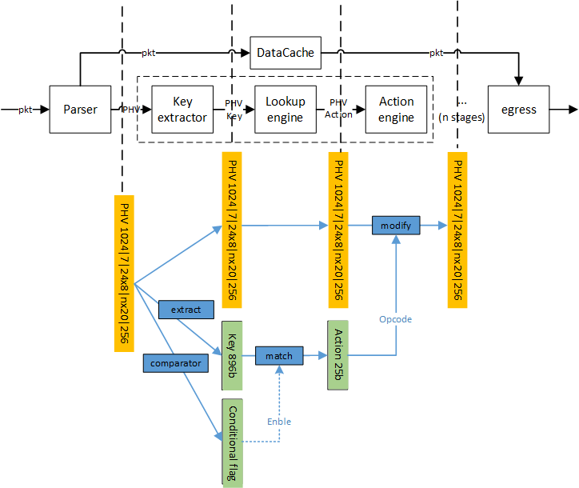
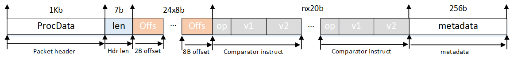
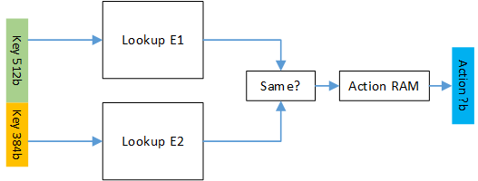
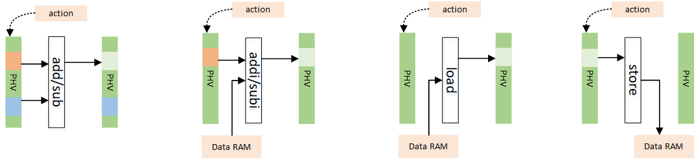
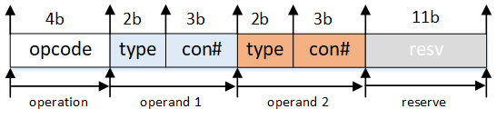
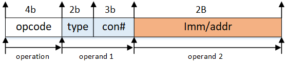

### Design notes



#### Packet Header Vector

basically, the packet header vector needs to contain **packet header**, **metadata** (ingress port, length, etc.) and also the **instruction**. The instruction defines **how to select the fields we extracted from the header and how to do with them** (put them into a MAT key? feed them into the comparator?)

The PHV is defined as:

```|1024b|7b|24x8b|nx20b|256b|```



* `1024b`: the first 1024b in the packet;

* `7b`: totally length of the header;

* `24x8b`: we support 24 different fields at most. They are divided into 3 groups. The 1st, 2nd and 3rd groups are used to locate the fields in 2B, 4B, 8B respectively (each group can hold 8 different fields at most). In each `8b`, the highest bit is the valid bit, the low `7b` is the offset in the first `1024b` of the PHV.

* `nx20b`: comparator sub-instruction in each stage (suppose there are 5 stages at this point).  

  > * highest `2b` is the opcode: `00` for `>`, `01` for `>=` and `10` for `==`
  > * the next `1b` is the immediate flag: `1` for immediate, `0` means the value needs to be retrieved from PHV.
  > * the next `8b` represents immediate or the way to retrieve the value from PHV.
  > * the lowest 9b represents the 2nd operator.

* `256b`: the metadata attached to the packet.

---

#### Key Extractor

Key Extractor is used to generate the key according to PHV.  meanwhile, in order to support `if-else` statement, Key Extractor module also set the value of the `conditional flag` according to the `nx20b` fields to determine if the match-action should be executed in the current stage.

* Key extraction:

  The key is extracted from the packet header based on the offsets in the `24x8b` field. the values extracted from the packet header will be stacked together to form a key. Be noted that if the valid tag of one specific field is `0`, the corresponding position in the key still needs to be retained to avoid dependency between those different fields.

* Comparation:

  In stage `M`, the 2 operands and the operator in `M`-th will be extracted and fed in to the comparator. If the result is `1`, the flag to the lookup table would be set, meaning the key will be matched in the lookup engine. Otherwise, the lookup engine would be bypassed and the action field will be set to `0` (meaning do nothing in the stage).

---

#### Lookup engine

Lookup Engine takes the key generated from Key Extractor, conducts a matching operation and outputs an `action` which determines the actions that need to execute in the Action Engine.



* Format of the lookup table entry

  each entry consists from one 896b entry and one 896b mask to support ternary match. 

  For example: entry1: `10011001...1001` mask1:  `111111111...1000` would avoid the match of the lowest 3 bits.

* Lookup elements

  Lookup Engine consists of 2 lookup elements, each of which is 512b wide and has 8 entries. 

* Control plane

  both lookup table entry and action ram are configured using AXI-Lite. 

---

#### Action Engine

Action Engine takes the `action` output from Lookup Engine, and modifies PHV according to it. The actions that will be supported in the demo include `add`, `addi`, `sub`, `subi`, `load` and `store`.



1. `add`: takes two operands from the PHV based on the indexes in the action field, add them, and write the result back to the location of 1st operand.
2. `addi` takes one operand from PHV based on the index in the action field and one operand from the action field directly, add them, and write the result back to the location of operand. 
3. `sub`: takes two operands from the PHV based on the indexes in the action field, substract the 2nd operand from the 1st, and write the result back to the location of 1st operand.
4. `subi`: takes one operand from the PHV based on the index in the action field and one from the action field directly, substract the 2nd operand from the 1st, and write the result back to the location of 1st operand.
5. `load`: read the value according to the address stored in the action field, write it into PHV according to the index in the action field.
6. `store`: read the value from PHV according to the index in the action field, write it into the address stored in the action field.

* Action format:

  For `add` (`0b'0001`) and `sub` (`0b'0010`)operations, the action format is:

  

  For `addi`(`0b'0011`), `subi`(`0b'0100`), `load`(`0b'0101`) and `store`(`0b'0110`), the action format is:

  
